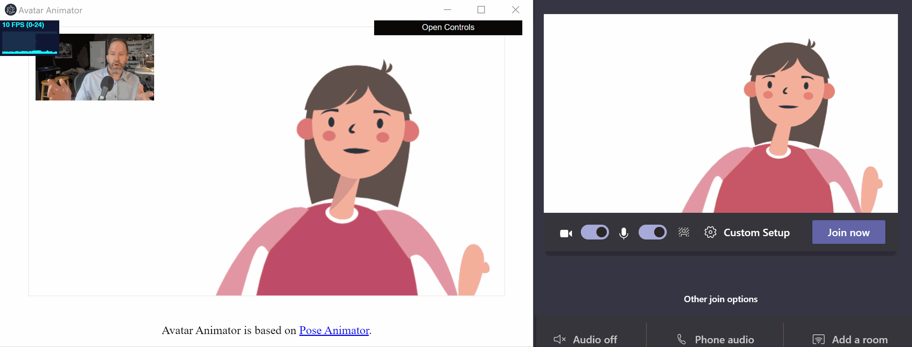
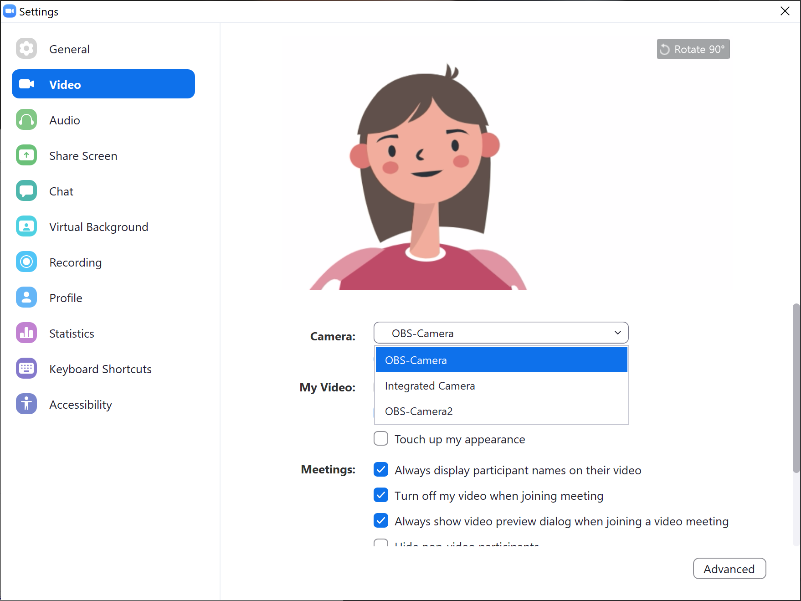
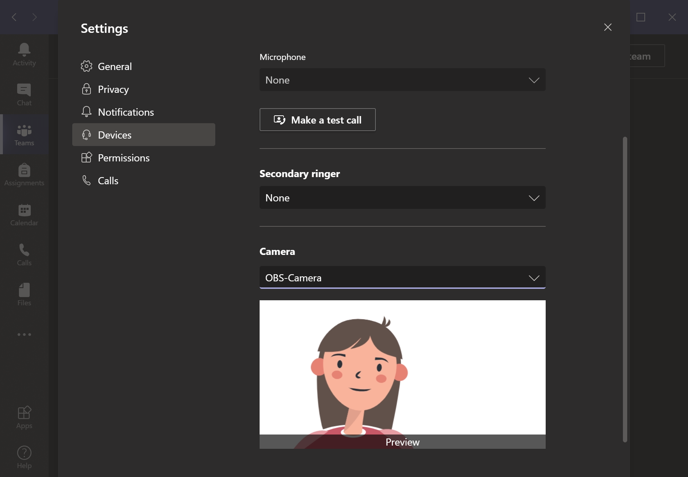
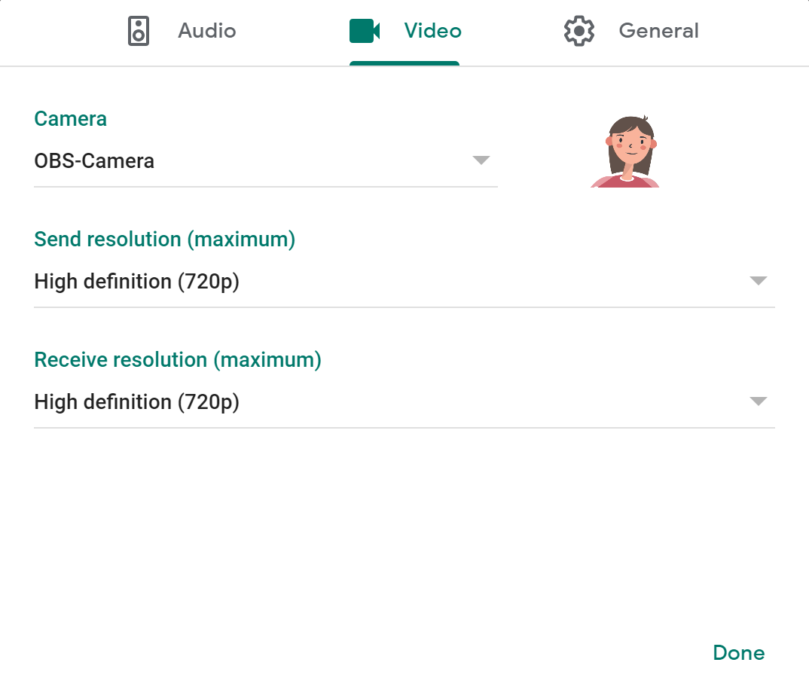
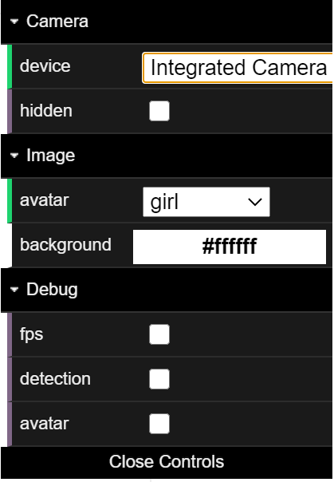

<!-- omit in toc -->
# Avatar Animator  

[Installation](#installation) | [Getting started](#getting-started) | [Configuration](#configuration) | [Development notes](#development-notes) | [Copyright and license](#copyright-and-license)

Avatar Animator generates real-time 2D vector-based avatar animations using webcams or other video-input sources. It can be used with several video-conferencing apps such as [Zoom](https://zoom.us/), [Skype](https://www.skype.com/), [Microsoft Team](https://www.microsoft.com/en-ww/microsoft-365/microsoft-teams/group-chat-software), [Google Meet](https://meet.google.com/), and [Slack](https://slack.com/). The project is a fork of [Pose Animator](https://github.com/yemount/pose-animator), a fast and real-time 2D vector illustrations animator based on Google's [PoseNet](https://github.com/tensorflow/tfjs-models/tree/master/posenet) and [FaceMesh](https://github.com/tensorflow/tfjs-models/tree/master/facemesh) model. Avatar Animator wraps Pose Animator in an [Electron](https://www.electronjs.org/) app and sends the video steam to a virtual camera using [node-virtualcam](https://github.com/letmaik/node-virtualcam).

**Demo of Avatar Animator using Microsoft Teams**. Instead of using a real webcam as the input source to Avatar Animator, the input is simulated with [OBS Studio](https://obsproject.com/) and [OBS-VirtualCam](https://github.com/Fenrirthviti/obs-virtual-cam) from a [YouTube video](https://www.youtube.com/watch?v=x_lHk9Lf-ow), leading to the following processing chain: YouTube (browser) 🠚 OBS Studio (desktop capture) 🠚 OBS-VirtualCam (1) 🠚 Avatar Animator 🠚 OBS-VirtualCam (2) 🠚 Microsoft Teams. Why? Just for fun...

## Installation

### Supported platforms

- Windows 10

**Note**: if you would like Avatar Animator on other platforms, mark your interest with 👍 in the [macOS](https://github.com/letmaik/avatar-animator/issues/3) or [Linux](https://github.com/letmaik/avatar-animator/issues/4) issue page.

### Prerequisites

Download and install the following prerequisites:

- [OBS Studio](https://obsproject.com/download)
- OBS-VirtualCam for [Windows](https://github.com/Fenrirthviti/obs-virtual-cam/releases)

**Note**: the installation of OBS Studio is only required to install the OBS-VirtualCam driver -- you do not need to run or configure OBS Studio for Avatar Animator to work.

### Avatar Animator

Download and unzip the latest version of Avatar Animator from the [release page](https://github.com/letmaik/avatar-animator/releases). The main program is named `avatar-animator.exe`.

## Getting started

Launch `avatar-animator.exe` then select `OBS-Camera` as your input stream in your video-conferencing app settings. Examples on how to do this for several video-conferencing apps are given in the table below:

| Application    | Procedure                                                                                                                                     | Screenshot |
| --------------- | --------------------------------------------------------------------------------------------------------------------------------------------- | ---------- |
| Zoom            | Go to `Settings` -> `Video` and select `OBS-Camera` from the `Camera` drop-down menu.                                                         |  |
| Skype           | Go to `Settings` -> `Audio & Video` and select `OBS-Camera` from the `Camera` drop-down menu.                                                 | TODO       |
| Microsoft Teams | Click on your profile picture at the top of Teams, then `Settings` -> `Devices` and select `OBS-Camera` from the `Camera` drop-down menu.     |  |
| Google Meet     | Start a meeting, then click `Settings` > `General` and select `OBS-Camera` from the `Camera` drop-down menu.                                  |  |
| Slack           | Start a call, then click on the gear icon in the top left corner of the call window and select `OBS-Camera` from the `Camera` drop-down menu. | TODO       |

## Configuration

The configuration panel (top right in Avatar Animator; figure below) allows the configuration of cameras, avatars and background colours, and display of debug information. To import new avatars or a background images, drag and drop them into Avatar Animator (note that new avatars will not be added to the `avatar` drop down menu). To create a new avatar, follow the instructions as detailed in [AVATARS.md](AVATARS.md).

    
     
    <b>Avatar Animator control panel.</b>

## Development notes

See [DEVELOP.md](DEVELOP.md).

## Copyright and license

Copyright notice is stated at the top of source files. Source code released under [Apache-2.0](LICENSE). Binary releases are currently released under [GPL-2.0](LICENSE_BIN) to conform with the licence requirement of [node-virtualcam](https://github.com/letmaik/node-virtualcam), also released under GPL-2.0.
